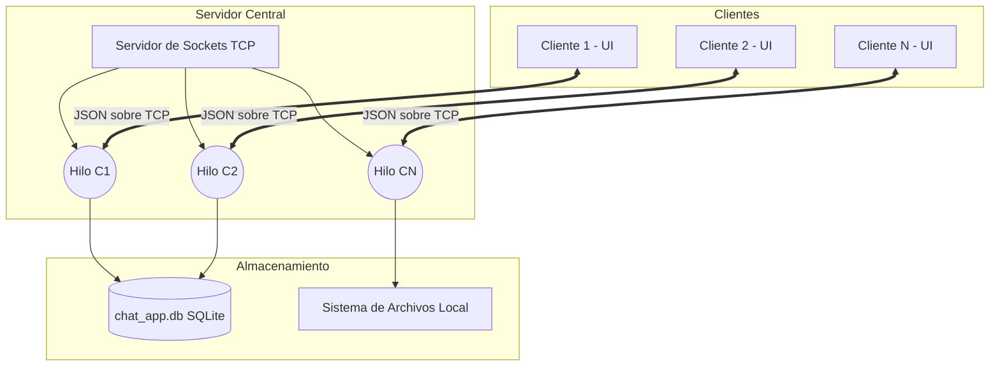
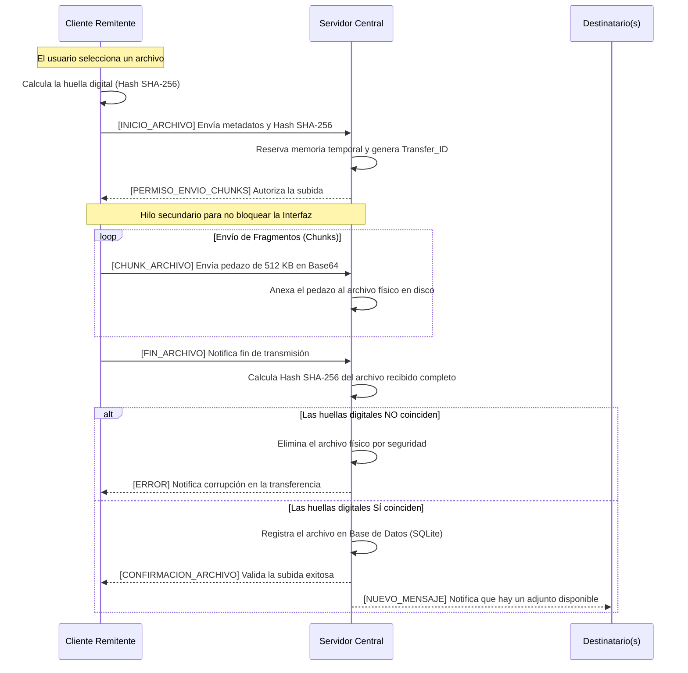
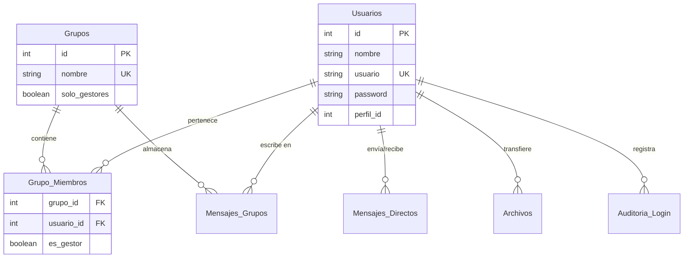

# 💬 Chat App Empresarial (Cliente-Servidor TCP)

Un sistema de mensajería corporativa robusto, seguro y eficiente desarrollado completamente en Python utilizando Sockets TCP puros y una arquitectura Multihilo. Diseñado para soportar mensajería en tiempo real, transferencia segura de archivos por streaming de bloques (chunks) y una gestión administrativa avanzada.

---

## 🚀 Características Principales

### 🔒 Seguridad e Integridad
* **Protección de Credenciales:** Las contraseñas nunca viajan ni se almacenan en texto plano. Se utiliza cifrado **SHA-256 con "Salt"** para evitar ataques de diccionarios (Rainbow tables).
* **Control de Integridad de Archivos:** Las transferencias de archivos utilizan hashing SHA-256. El servidor calcula y compara la "huella digital" del archivo original contra el archivo recibido; si se detecta la pérdida de un solo byte (corrupción), la transferencia se rechaza automáticamente.
* **Tolerancia a Fragmentación TCP:** Implementación de un búfer inteligente con decodificación "Raw JSON" que acumula y procesa fragmentos de red, evitando bloqueos o pérdida de mensajes por paquetes TCP cortados.

### 👥 Gestión de Usuarios y Permisos (ABM)
* **Perfiles de Usuario:** Distinción entre Usuarios estándar y Administradores.
* **Administración Centralizada:** Los administradores pueden crear, editar, eliminar cuentas, forzar cambios de contraseña y promover otros usuarios a roles de administración en tiempo real.
* **Modo Impersonación (Modo Dios):** Función exclusiva para Administradores que permite "tomar control" de la cuenta de cualquier usuario para auditoría visual o soporte, pudiendo retornar a su cuenta original de forma segura.

### 🏢 Gestión de Grupos (Salas de Chat)
* **Salas Dinámicas:** Creación de grupos privados y públicos.
* **Roles de Grupo (Gestores):** Los creadores y usuarios designados como "Gestores" tienen permisos elevados dentro del grupo.
* **Control de Participación:** Los gestores pueden expulsar/añadir miembros de forma masiva y cambiar los roles de otros usuarios.
* **Modo "Solo Gestores":** Capacidad de bloquear un grupo para que los usuarios estándar solo puedan leer, limitando la escritura a los Gestores (ideal para canales de anuncios).
* **Gestión de Historial:** Los gestores pueden vaciar el historial del chat para todos los miembros del grupo.

### ✉️ Mensajería y Herramientas de Chat
* **Mensajes Directos y Grupales:** Comunicación instantánea con actualización de estado (Online/Offline) en tiempo real.
* **Respuestas Contextuales:** Posibilidad de responder a mensajes específicos (Reply-to) con trazabilidad visual en el chat.
* **Gestión de Historial Local:** Los usuarios pueden vaciar historiales de chats directos de su propia interfaz.

### 📂 Transferencia de Archivos (Streaming por Chunks)
* **Subidas y Descargas en Segundo Plano:** En lugar de enviar archivos pesados en un solo bloque (lo que congela la interfaz y satura la memoria RAM), el sistema corta el archivo en pequeños fragmentos (Chunks de 512KB para subida, 256KB para descarga).
* **Gestor de Archivos de Chat:** Un panel dedicado por chat para ver, descargar y eliminar archivos compartidos históricamente en esa conversación.
* **Prevención de Sobreescritura:** Descargas seguras que auto-renombran archivos (ej. `archivo(1).pdf`) si el fichero ya existe en el directorio local.

### 🕵️‍♂️ Sistema de Auditoría
* **Trazabilidad Total:** Registro automático en Base de Datos de cada evento crucial: Logins, Logouts, creaciones de grupos, cambios de roles, expulsiones, envíos y descargas de archivos.
* **Panel de Auditoría Filtrable:** Interfaz para el Administrador con búsqueda en tiempo real por IP, fecha, usuario o acción.
* **Exportación CSV:** Capacidad de exportar los logs de auditoría filtrados a una hoja de cálculo para análisis externo.

---

## 🧠 Arquitectura del Sistema

El proyecto sigue un modelo estricto **Cliente-Servidor**.
* **El Servidor (`server.py`):** Actúa como el núcleo central. Maneja la concurrencia delegando cada conexión entrante a un hilo (`Threading`) dedicado. Interactúa exclusivamente con la base de datos SQLite y actúa como un "Router" de mensajes, determinando a quién debe retransmitirse cada paquete.
* **El Cliente (`client.py`):** Mantiene una conexión persistente (Keep-Alive) con el servidor. Utiliza un hilo secundario de escucha en bucle continuo para no bloquear la interfaz gráfica (UI) construida en `Tkinter`.

### Diagrama de Arquitectura de Red


### Diagrama de Flujo: Transferencia de Archivos Segura (Streaming)

La transmisión de archivos evita los cuellos de botella en la red y la saturación de memoria RAM mediante una negociación previa de permisos y el envío por fragmentos (chunks), asegurando la integridad criptográfica al finalizar.


## 🛠️ Tecnologías y Librerías

El sistema ha sido construido utilizando exclusivamente la biblioteca estándar de **Python 3.11+**, garantizando una arquitectura "Zero-Dependencies" (no requiere instalar paquetes externos mediante `pip`).

### 🐍 Arquitectura Base y Concurrencia
* **Manejo de Hilos (`threading`):** Procesamiento concurrente que permite al servidor atender a múltiples clientes de forma simultánea, y al cliente enviar/recibir archivos pesados en segundo plano sin congelar la interfaz.
* **Gestión del Sistema (`os`, `uuid`):** Interacción directa con el sistema operativo local para la creación de directorios, guardado seguro de archivos evitando sobreescrituras y generación de identificadores únicos universales para las transferencias.

### 🌐 Redes y Comunicación
* **Sockets TCP/IP (`socket`):** Implementación de conexiones persistentes y confiables bajo el protocolo TCP (`AF_INET`, `SOCK_STREAM`), garantizando la entrega ordenada de los paquetes de red entre el servidor central y los clientes.
* **Estructuración de Datos (`json` y `base64`):** Serialización de mensajes mediante uso avanzado de `JSONDecoder().raw_decode()` para el búfer de red (evitando fragmentación), y codificación en Base64 para encapsular archivos binarios de forma segura durante su transporte.

### 🔒 Seguridad y Persistencia
* **Criptografía Segura (`hashlib`):** Implementación del algoritmo SHA-256 para proteger contraseñas (agregando un "Salt" de seguridad) y para calcular la "huella digital" de los archivos, garantizando la integridad de las transferencias.
* **Base de Datos Integrada (`sqlite3`):** Motor relacional embebido, rápido y ligero, que gestiona automáticamente toda la persistencia del sistema (mensajes, usuarios, grupos, permisos y logs) sin requerir instalación de motores externos.

### 🖥️ Interfaz de Usuario y Reportes
* **Interfaz Gráfica Nativa (`tkinter` y `tkinter.ttk`):** Construcción del frontend de escritorio responsivo, que incluye manejo de eventos, ventanas modales complejas, árboles de datos (Treeviews) interactivos y menús contextuales.
* **Exportación de Datos (`csv`):** Generación de reportes de auditoría directamente en formato de hoja de cálculo estándar para el análisis externo de la actividad del servidor.

## 🗄️ Esquema de la Base de Datos Relacional

El sistema genera y gestiona de forma autónoma una base de datos SQLite (`chat_app.db`). La arquitectura de datos está altamente normalizada para evitar redundancias y mantener la integridad referencial entre usuarios, grupos, mensajes y auditorías.

### Diagrama Entidad-Relación (ER)



👤 Entidades de Acceso y Control
* Usuarios: Almacena las identidades, credenciales cifradas y el nivel de acceso al sistema.
* Columnas: id (PK), nombre, usuario (Único), password (Hash SHA-256 + Salt), perfil_id (1 = Administrador, 2 = Estándar).
* Auditoria_Login: Registro inmutable (log) de eventos críticos de seguridad, administración y transferencias.
* Columnas: id (PK), fecha, ip, usuario, accion (Ej: LOGIN, CREÓ GRUPO, EXPULSÓ DE #Ventas, DESCARGÓ ARCHIVO).

### 🏢 Entidades de Agrupación (Salas)
* Grupos: Definición central de las salas de chat corporativas y sus configuraciones de privacidad.
* Columnas: id (PK), nombre (Único), solo_gestores (Booleano: 1=Bloqueado/Solo Lectura, 0=Público/Escritura libre).
* Grupo_Miembros: Tabla pivote (relación muchos a muchos) que vincula qué usuarios pertenecen a qué grupos y define su jerarquía local.
* Columnas: grupo_id (FK), usuario_id (FK), es_gestor (Booleano: 1=Administrador del grupo, 0=Miembro regular).

### ✉️ Entidades de Comunicación y Datos
* Mensajes_Directos: Registro cronológico de las conversaciones privadas (1 a 1) entre los empleados.
* Columnas: id (PK), fecha, remitente, destinatario, mensaje, es_archivo, archivo_path, reply_to (Referencia a mensajes anteriores).
* Mensajes_Grupos: Registro del historial de los canales de chat grupales, permitiendo que nuevos miembros lean el contexto previo.
* Columnas: id (PK), fecha, grupo, remitente, mensaje, reply_to.
* Archivos: Metadatos de seguridad de los ficheros adjuntos. Separa el nombre original que ve el usuario, del nombre ofuscado y único que se guarda en el disco del servidor para evitar colisiones.
* Columnas: id (PK), remitente, destino, nombre_original, nombre_servidor (UUID + Nombre), fecha.

### ⚙️ Instalación y Uso

Gracias a su arquitectura "Zero-Dependencies", desplegar el sistema es un proceso directo que no requiere entornos virtuales complejos ni la instalación de paquetes de terceros. Solo necesitas tener **Python 3.11 o superior** instalado en tu sistema.

### Paso 1: Clonar el Repositorio
Descarga el código fuente a tu máquina local utilizando Git, o descargando el archivo ZIP directamente desde GitHub:
```bash
git clone (https://github.com/sheyk87/Chat_Cliente_Servidor_Python.git)](https://github.com/sheyk87/Chat_Cliente_Servidor_Python.git)
cd chat-app-empresarial
```

### Paso 2: Iniciar el Servidor Central
El servidor es el núcleo de la red y debe ejecutarse antes que cualquier cliente.

* Abre una terminal en la carpeta del proyecto y ejecuta:

```bash
python server.py
```

¿Qué sucede en el primer inicio?
* El servidor realizará un despliegue automático (Auto-Setup):
* Creará la base de datos chat_app.db con todas las tablas relacionales.
* Generará la carpeta local archivos_servidor para alojar los adjuntos.
* Creará la cuenta maestra de administración con su contraseña cifrada.
* Comenzará a escuchar conexiones TCP entrantes en 127.0.0.1:65432.

### Paso 3: Iniciar los Clientes
Una vez que el servidor esté en ejecución y escuchando, abre una (o varias) terminales nuevas y ejecuta la aplicación cliente:

```bash
python client.py
```
💡 Tip de pruebas: Puedes ejecutar el comando python client.py múltiples veces simultáneamente para abrir varias ventanas y simular una conversación entre distintos usuarios en la misma computadora.

### Paso 4: Primer Acceso y Credenciales
Utiliza la cuenta maestra generada automáticamente por el sistema para tu primer inicio de sesión:

Usuario: `admin`

Contraseña: `admin`

⚠️ Advertencia de Seguridad: Al tratarse de un entorno empresarial, es obligatorio dirigirse al menú superior "Mi Cuenta -> Cambiar Contraseña" e ingresar una nueva clave segura inmediatamente después del primer inicio de sesión. A partir de ese momento, podrás usar el menú de "Administración" para dar de alta al resto de los empleados.
